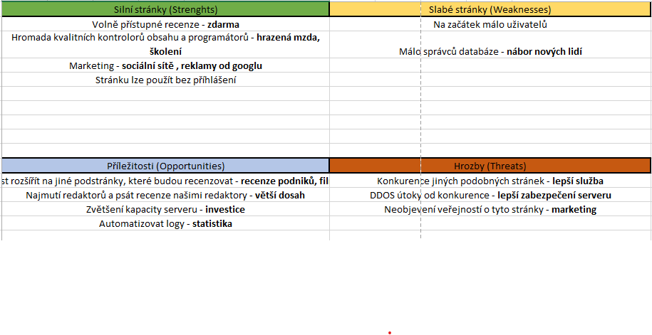
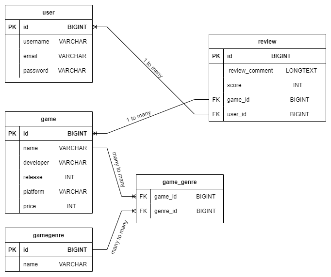

# 7SWI1 SEMESTRÁLNÍ PROJEKT (2022)
 
### -- Téma: webová aplikace, na které mohou dávat uživatelé recenze an hry s daným score
### -- Přihlášený uživatel se (user) může recenzovat hru jen jednou. A pokud by chtěl změnit recenzi, tak pozmění staré score a text k recenzi nebo případně ji smaže. (Manipuluje maximálně se svojí recenzí)
### -- Nepříhhlášený uživatel může zobrazit recenze, ale nemůžu je bez přihlášení přidávat ři jinak s nima minipulovat.
### -- Backend: Spring Boot REST
### -- frontend: Next.Js

## SWOT

## DATABASE SCHEME

## ARCHITECTURE DIAGRAM:

## CLASS DIAGRAM:

- [User](images/class/user_class.png)
- [Game](images/class/game_class.png)
- [GameGenre](images/class/gameGenre_class.png)
- [Review](images/class/review_class.png)

## USE CASE:
- [Use cases](images/use_case/swi_project_use_cases.pdf)

## Analytical Sequence Diagram:

## Design Sequence Diagram:

## EPC Diagram:
