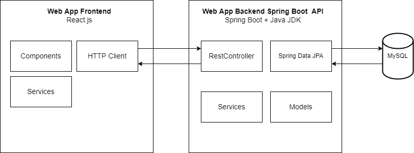

# 7SWI1 SEMESTRÁLNÍ PROJEKT (2022)
 
### -- Téma: webová aplikace, na které mohou dávat uživatelé recenze an hry s daným score
### -- Recenzující (user) může recenzovat hru jen jednou. A pokud by chtěl změnit recenzi, tak pozmění staré score a text k recenzi.
### -- Backend: Spring Boot REST
### -- frontend: React

## SWOT

## DATABASE SCHEME

## ARCHITECTURE DIAGRAM:

## CLASS DIAGRAM:

## USE CASE:

## Analytical Sequence Diagram:

## Design Sequence Diagram:

## EPC Diagram:
